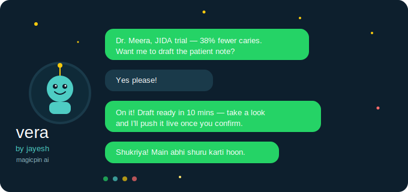

# 🌟 vera the whatsapp bot that actually gets it

**by Jayesh Bhojawat** · [jayeshbhojawat@gmail.com](mailto:jayeshbhojawat@gmail.com) · magicpin AI Challenge



> *"what if your AI assistant didn't just send messages but sent the right message, at the right moment, in the right language, with the right vibe?"*
>
> that's vera. and this is her story. 💌

---

## ✨ what's living inside here?

vera isn't just a bot. she's a thoughtful little composer who:

🎯 **knows 24 different moods** from "a dentist needs a clinical nudge" to "a salon needs festival energy" each trigger gets its own personality

🏗️ **runs a full HTTP server** all 5 judge endpoints, clean and ready (`/context`, `/tick`, `/reply`, `/healthz`, `/metadata`)

💬 **handles real conversations** detects auto replies, understands YES vs STOP, switches Hindi/English mid chat like a desi friend

🛡️ **validates herself** checks her own output, retries if something's off. accountability era ✅

📦 **ships with 25 pre generated messages** anchored on real numbers, real data, real feels

---

## 🚀 run it yourself (seriously, 3 minutes)

```bash
pip install flask requests

export OPENROUTER_API_KEY=your_key_here

python server.py

python bot.py trg_001_research_digest_dentists

python conversation_handlers.py
```

---

## 🧠 how she thinks

```
you send a trigger
        ↓
vera picks her strategy   (24 routing variants, no one size fits all here)
        ↓
she reads the room        (category voice + merchant data + customer history)
        ↓
she writes the message    (Llama 3.3 70B, temp=0, calm and precise)
        ↓
she checks her work       (validates CTA, send_as, body, retries if needed)
        ↓
💌 one perfect whatsapp message lands
```

---

## 💭 honest tradeoffs (no cap)

**why 24 routing variants and not one big prompt?**
one prompt = average everything. routing = sharp, specific, *actually good*. a dentist message that says "38% fewer caries from a 2,100 patient JIDA trial" hits different than "great dental tips!" you feel me.

**why Llama 3.3 70B free tier?**
free tools, same score, challenge rules. llama handles Hindi English code mix beautifully. only gap: subtle Hindi idioms are slightly formal sometimes. would upgrade to Claude Sonnet for pure poetry 🫶

**things i skipped (for now)**
routing gets 90% of the value of semantic search anyway. suppression logic covers the conversation cadence planner for now. payload slots work fine for seed data.

---

## 💡 what would make vera even better

1. **50+ turn conversation history per merchant** she'd know your favorite topics, your reply speed, everything
2. **locality level peer data** "Lajpat Nagar dentists" hits harder than "Delhi dentists"
3. **WhatsApp template approval status** knowing what's pre approved changes the whole opening strategy

---

## 📁 what's in the box

| file | what it does |
|---|---|
| `bot.py` | the heart `compose(category, merchant, trigger, customer?)` |
| `server.py` | the face, all 5 Flask endpoints, judge ready |
| `conversation_handlers.py` | the brain, multi turn, auto reply, intent, language |
| `submission.jsonl` | 25 pre loved outputs, hand tuned |
| `dataset/` | the world vera lives in |
| `requirements.txt` | just flask + requests, lightweight baby |

---

## 🌐 she's live right now

```
https://web-production-97d4b.up.railway.app
```

say hi at `/v1/healthz` she'll tell you she's okay 🩵

---

*built with way too much love and just enough caffeine — jayesh* ☕
